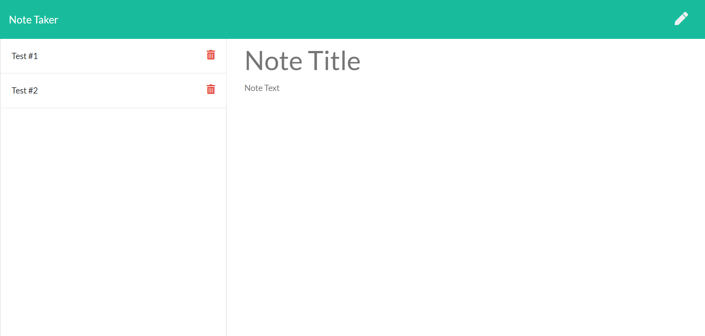

# Note Taker

Note taker is an application that allows the user to create, save and delete notes from and to a server. The applicaiton is built using NPM express and it made public and online using Heroku. The user can type notes and save them to the server. The user can also delete notes. All users will see the same notes and have the same access since the site is public. 

## Website Screenshot

## Link to Website
[Note Taker](https://evening-reaches-92439.herokuapp.com/)